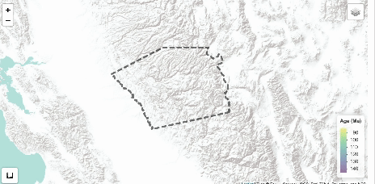

<!-- PROJECT LOGO AND INTRO SECTION -->
<br />
<div align="center">
  <h2 align="center">Flow Through the Ages: Geologic Age Prediction in the Sierra Nevadas</h2>

  <p align="center">
    Welcome! This collaborative project aims to innovate rock age prediction using machine learning models. 
    Our goal is to fill in gaps between known geologic ages to better understand magma migration patterns 
    in the Sierra Nevadas.
</p>
  
<p align="center">
    
</p>

</div>

>__Note:__ This is an ongoing project! I am currently in the process of predicting unknown ages using the trained models.
These predictions will then be added to the Shiny app to help researchers understand the overall magamtic flow in the area.


__Quick Links:__

* [Interactive Shiny Dashboard](https://iawc6a-lily-northcutt.shinyapps.io/geoAges/) (uniform grid predictions coming soon!)
* [Code](main_experiment.ipynb)
* [Writeup](https://lilynorthcutt.github.io/portfolio/portfolio/projects/sierraNevadaAge/writeup.html)


<!-- About The Project -->
## About The Project 
The main goals of this project are to accomplish the following:
*  __Develop novel machine learning (ML) methods__ to fill gaps in geologic 
maps by predicting undated rock ages.
* __Apply the results from the model__ to predict undated rock ages, and access a less biased view of 
magmatic migration.
*  __Build Interactive Visualizations__ for researchers and curious minds to view and explore the data and predictions.


<!-- Getting Started -->
## Getting Started
This project uses python for data ingestion, processing, and model creation, and R for the interactive Shiny dashboard.
All predictions from trained models are stored in `Data/output/model_output.xlxs`, and accessed by  
`R/app/global.R` along with the processed data to build the visuals for the app.


<!-- Installation Instructions -->
### Installation Instructions
To get started, please clone the repo:
```bash
git clone https://github.com/lilynorthcutt/sierraNevadaAge.git
```


<!-- Running the Code -->
### Running the Code
__If you would like to use the processed data in the `Data/processed/` folder, then you are
good to go!__ 

But, if you want to use the raw data and go through the ingestion, cleaning, wrangling, and feature engineering process
from scratch then the following is necessary:

Navigate to the get_url_for_zip() within the `elevation.py` file of the pyhigh package (`python3.9/pyhigh/elevation.py`). 
The USGS no longer allows downloads of the elevation data referenced in the get_url_for_zip(), thus we can access the data from 
a different site. You can use the site I use by updating the get_url_for_zip() function as shown here:

```bash
 def get_url_for_zip(zip_name):
    return f'https://firmware.ardupilot.org/SRTM/North_America/{zip_name}'
```
> You can find more info under this [github issue](https://github.com/sgherbst/pyhigh/issues/1)


<!-- Data -->
## Data
This project uses two data types:

1. __CSV File:__ Around 215 points were aggregated from 40 sources of published and unpublished papers. Most importantly,
for our analysis, it contains the dated sample ages and their respective locations.
    > :bangbang: If you have additional data you think would be relevant to add to this project, or an amendment to any data used,
please reach out to me via email: _northcuttlilya@gmail.com_

2. __SHAPEFILES:__ There are 4 shapefiles, in our raw data and 5 in our processed data. The main two shapefiles we focus on are:
    
   * *DetailedMapDataAreaBoundaryLine* - Contains linestring with boundary for region of interest
   *  *CretaceousIntrusionsIndividualPolygons* - Contains detailed polygons (approx. 1400), along with a label of its geologic time period
      (Early Cretaceous (eK), Late Cretaceous (lk), and Cretaceous-Jurassic (KJ) )

   Additionally, in the processed data there is one more shapefile:
   
   * _UnionPolygons_ - Contains the union of all polygons of the same time period. This condenses the ~1400 polygons significantly
   without losing the shapes or time period labels.
